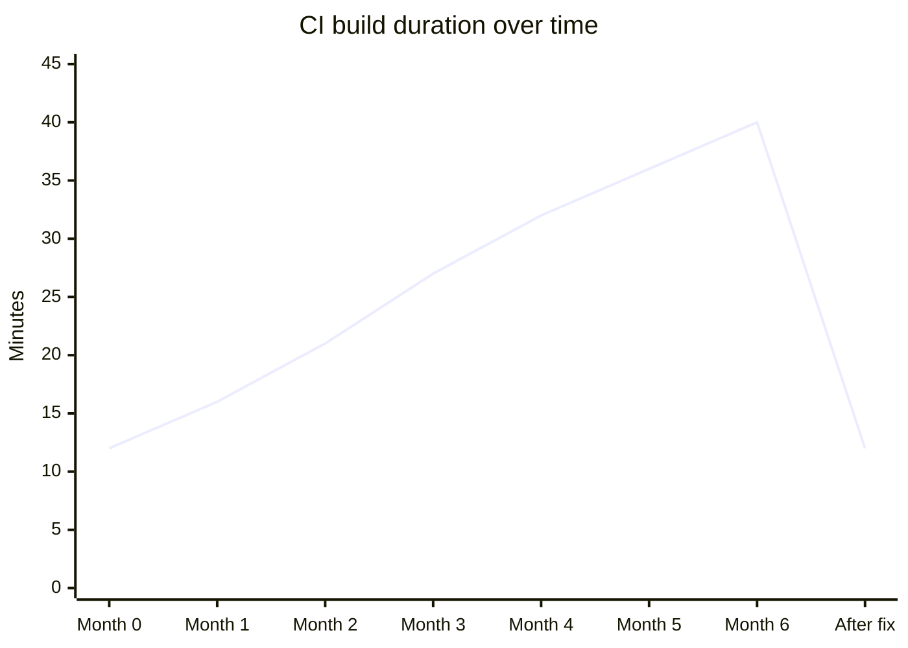

# Writing Plan

**Editor gate verdict:** ✅ **Strong angle** — this has a concrete incident, measurable regression and recovery, and a useful lesson for CI owners: slow degradation becomes invisible unless you measure the thing degrading.

**Self-approval:** Approved to write. The user requested autonomous execution, so the plan below is self-approved.

**Hook:** A new hire asked why builds took 40 minutes, and that uncomfortable question exposed six months of normalized CI decay.

**Sections:**

1. **The question nobody wanted to ask** — Opens with the incident and establishes the human problem: everyone had adapted to slow builds.
2. **How a 12-minute build became a 40-minute build** — Explains the slow degradation and why it escaped notice.
3. **The Dockerfile change that broke the cache** — Shows the COPY-order mistake and the corrected pattern, with only the relevant lines.
4. **The missing metric** — Explains why wall-clock build time was not enough and why cache hit rate became the dashboard signal.
5. **What to measure before your pipeline quietly rots** — Gives readers concrete checks they can apply to their own CI systems.

**Takeaway:** If you own CI, do not only measure build duration. Measure the intermediate signals that explain build duration, because humans normalize gradual pain faster than dashboards do.

**Visuals:**

1. Mermaid timeline showing build time drifting from 12 to 40 minutes, then returning to 12 after the Dockerfile/cache fix. This replaces several paragraphs of chronology.
2. Small before/after Dockerfile snippet showing the COPY order that invalidated dependency caching and the corrected version. This is more useful than describing Docker layer caching abstractly.
3. Optional screenshot placeholder for a dashboard panel showing build duration plus Docker cache hit rate. This makes the monitoring lesson concrete.

---

# Title

Our CI Got 3x Slower and Nobody Noticed

## Alternate titles

1. The Docker Cache Miss That Turned 12-Minute Builds Into 40-Minute Builds
2. Your CI Pipeline Is Probably Slower Than You Think

---

# Post

A new hire asked the question the rest of us had quietly stopped asking:

“Is it normal that builds take 40 minutes?”

The uncomfortable answer was no. Or at least, it had not always been normal. Six months earlier, the same pipeline usually finished in about 12 minutes. Somewhere along the way, 12 had become 18, then 25, then 32, and eventually 40. Nobody rang an alarm. Nobody opened an incident. We just adjusted our habits around it.

Start a build, get coffee. Start a build, answer Slack. Start a build, reconsider every architectural decision since 2019.

The fix was not a bigger runner, a new CI provider, or a heroic rewrite of the pipeline. The root cause was much smaller and much more annoying: our Docker layer cache hit rate had silently dropped to near zero after a Dockerfile refactor changed the order of `COPY` commands.

Once we put the dependency install step back before the source copy, builds went from roughly 40 minutes back to 12.

The lesson was not “Docker cache good.” We already knew that. The lesson was that slow degradation is almost invisible unless you measure the thing that is degrading.

## The slow part was not sudden

If a build jumps from 12 minutes to 40 minutes overnight, people notice. Someone complains in chat. Someone assumes the CI provider is on fire. Someone says the phrase “quick rollback,” usually while not feeling quick at all.

That is not what happened here.

Our build got slower gradually over about six months. Each week felt only a little worse than the week before. The pipeline still passed. Deploys still happened. Pull requests still merged. Nothing was obviously broken.

That made it easy to explain away. A few more tests had been added. The app had grown. Maybe it was just “one of those things.”

This is how performance regressions sneak into internal tooling. They do not always arrive as a dramatic failure. Sometimes they arrive as a new baseline.

[IMAGE: Timeline chart showing CI build duration drifting from 12 minutes to 40 minutes over six months, then dropping back to 12 minutes after the Dockerfile cache fix.]



## The cache was basically gone

The pipeline built a Docker image as part of CI. Like most Docker-based builds, it relied on layer caching to avoid reinstalling dependencies from scratch every time.

The important part looked conceptually like this before the refactor:

```dockerfile
COPY package.json package-lock.json ./
RUN npm ci

COPY . .
RUN npm run build
```

That structure matters. Docker can reuse the `npm ci` layer as long as the dependency files have not changed. Source changes do not invalidate the dependency install layer, so most builds skip the expensive install step.

During a cleanup, the Dockerfile was reordered to look more like this:

```dockerfile
COPY . .
RUN npm ci
RUN npm run build
```

That reads cleanly. It is also a cache trap.

With `COPY . .` before `npm ci`, almost any source change invalidates the layer before dependency installation. Change an application file, a test, a README, or anything else included in the build context, and Docker has to rerun the dependency install.

The Dockerfile still worked. The image still built. The tests still ran. The only thing that changed was that the most expensive layer became much harder to reuse.

That is the worst kind of CI regression: technically correct, operationally painful.

The fix was to restore the dependency-first ordering:

```dockerfile
COPY package.json package-lock.json ./
RUN npm ci

COPY . .
RUN npm run build
```

In your stack, the files may be different: `requirements.txt`, `poetry.lock`, `go.mod`, `pom.xml`, `Gemfile.lock`, or something else. The principle is the same.

Copy the files that define dependencies first. Install dependencies. Then copy the rest of the source.

You want your dependency layer to change only when dependencies change.

## Build time told us something was wrong, but too late

We had build duration on a dashboard. That sounds like enough. It was not.

Build duration is a symptom. It tells you that users are waiting longer, but it does not always tell you why. By the time the number is embarrassing enough to trigger action, the team may already have normalized the pain.

What we did not have was a metric for Docker layer cache hit rate.

Once we looked at cache behavior, the problem was obvious. The cache was missing constantly, which meant the pipeline was repeatedly paying for work it should have reused.

After the fix, we added cache hit rate beside build duration on the CI dashboard. The goal was not to make the dashboard prettier. The goal was to catch the next regression while it was still a small weird dip, not six months of wasted minutes hiding in plain sight.

[IMAGE: Dashboard screenshot placeholder showing two panels side by side: CI build duration in minutes and Docker layer cache hit rate percentage, with an annotation at the Dockerfile fix.]

A useful CI dashboard should answer two questions:

1. Are developers waiting longer?
2. Which reusable parts of the pipeline stopped being reusable?

The second question is where the real diagnosis usually starts.

## Humans normalize slowness quickly

The strangest part of this incident was not the Dockerfile mistake. People make refactors that accidentally hurt caching all the time.

The strange part was how easily the team adapted.

A 40-minute build should have felt absurd. Instead, it became background radiation. People changed their behavior around the pipeline rather than questioning the pipeline itself.

That is not a team failure. That is a human failure mode.

When something gets 5% slower at a time, your brain updates its definition of normal. You stop comparing today to six months ago. You compare today to yesterday, and yesterday was only slightly less annoying.

Metrics are useful because they do not have that problem. A chart can remember that your build used to take 12 minutes even after everyone else has emotionally accepted 40.

## What I would measure now

If you own a CI pipeline, build duration is only the starting point. Keep it, but do not stop there.

I would track the signals that explain build duration:

| Area | Metric to watch | Why it matters |
| --- | --- | --- |
| Docker builds | Layer cache hit rate | Catches dependency reinstall and rebuild regressions |
| Dependencies | Install step duration | Shows when package installation becomes the bottleneck |
| Tests | Test runtime by suite | Separates slow tests from slow builds |
| Queueing | Time waiting for a runner | Distinguishes CI capacity problems from pipeline problems |
| Artifacts | Upload/download duration | Exposes hidden time spent moving files around |

You do not need a perfect observability setup to start. Even a small dashboard with build duration, dependency install duration, and cache hit rate would have caught our issue earlier.

Measure the expensive assumptions in your pipeline.

If your build assumes Docker caching works, measure whether Docker caching works. If your build assumes dependency installation is cheap because it is cached, measure whether it is actually cached. If your build assumes parallel test jobs are balanced, measure whether one job is quietly doing most of the work.

CI pipelines are full of these assumptions. They are fine until they silently stop being true.

## The practical takeaway

The Dockerfile bug was easy to fix. Seeing it was the hard part.

A new hire noticed because they had not been slowly trained to accept the delay. They had fresh eyes and one very reasonable question: why does this take so long?

Your dashboard should be able to ask that question before a person has to.

Pick one slow CI job this week. Look at its duration over the last few months. Then pick one underlying mechanism it depends on — Docker cache, dependency cache, test splitting, runner availability, artifact transfer — and add a metric for that.

Do not wait for the build to become obviously broken. By then, your team may have already built a lifestyle around waiting for it.

---

# Editor's Notes

## `[FILL: ...]` items

- `[FILL: CI provider]` if you want to name the actual platform, such as GitHub Actions, GitLab CI, CircleCI, Buildkite, Jenkins, or another system.
- `[FILL: approximate timeline/date]` if you want the opening to mention when this happened.
- `[FILL: package ecosystem]` if the real project was not Node/npm. The post currently uses `package.json`, `package-lock.json`, and `npm ci` as a representative Dockerfile example; replace with the real dependency files and install command if different.
- `[FILL: how cache hit rate was measured]` if you want to include implementation specifics for extracting Docker cache hits from build logs or CI telemetry.

## Visuals to create

1. **Timeline chart:** Build duration over six months, starting near 12 minutes, drifting up to 40 minutes, then dropping back to 12 after the Dockerfile fix.
2. **Dockerfile before/after snippet:** Highlight the bad ordering (`COPY . .` before dependency install) and the corrected ordering (dependency manifest copy, install, then source copy).
3. **Dashboard screenshot/mockup:** Two panels: build duration and Docker layer cache hit rate, annotated at the fix point.

## Social summary

A 12-minute CI build slowly became a 40-minute build because Docker layer caching quietly stopped working — and the real lesson was to measure the assumptions your pipeline depends on.
