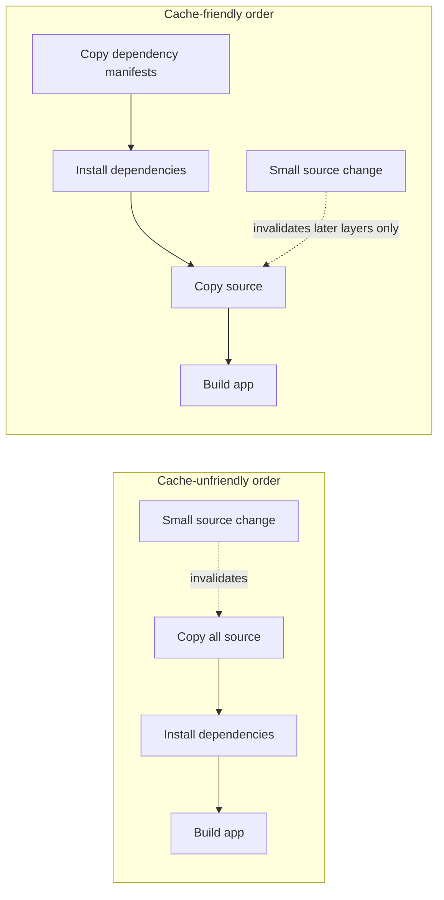

# Blog-editor plan and deliverable

## Phase 1: Editor's gate

✅ **Strong angle** — this has a real incident, a concrete root cause, and hard numbers: a six-month CI slowdown from 12 minutes to 40 minutes, traced to Docker layer cache misses and fixed with both a Dockerfile change and a metric.

## Phase 2: Interview notes

No live interview was possible, so I treated the provided notes as authoritative and used `[FILL: ...]` markers where only the author can supply specifics.

Already answered:

- Core incident: CI got 3x slower over six months.
- Discovery moment: a new hire asked why builds took 40 minutes.
- Root cause: Docker layer cache hit rate silently dropped near zero after `COPY` commands were reordered.
- Fix: move dependency install before source copy; add cache-hit-rate metric to dashboard.
- Outcome: builds returned from 40 minutes to 12 minutes.
- Lesson: slow degradation is invisible without metrics; humans normalize slowness.
- Audience: mid-level developers who own CI pipelines.
- Platform: dev.to.

## Phase 3: Writing plan

**Working title:** How a Dockerfile Reorder Quietly Tripled Our CI Time

**Hook:** A new hire asked a simple question — why do builds take 40 minutes? — and accidentally exposed six months of normalized CI pain.

**Sections:**

1. **The question we should have asked months earlier** — opens with the new hire moment and establishes the 40-minute build as a normalized problem.
2. **The slowdown was gradual, so it became invisible** — explains why a 12-to-40-minute drift escaped attention: no metric, no alert, and lots of human adaptation.
3. **The root cause was hiding in Docker layer caching** — shows how reordering `COPY` commands invalidated dependency layers and dropped cache hit rate near zero.
4. **The fix was small; the guardrail mattered more** — covers moving dependency install before source copy and adding cache-hit-rate visibility.
5. **What I would check in any CI pipeline now** — ends with an actionable checklist for readers.

**Takeaway:** If build duration matters, measure the mechanics behind it — especially cache hit rate — because humans are extremely good at normalizing slow degradation.

**Visuals:**

1. Mermaid diagram comparing the bad and fixed Docker layer order — earns its place because layer invalidation is easier to see than explain.
2. Simple before/after metric table — earns its place because the numbers are the story.
3. Dashboard screenshot placeholder for cache-hit-rate metric — optional but useful if the author can capture the real graph.

**Self-approval:** Approved autonomously per task instruction. The plan is focused on one incident, one technical mechanism, and one practical lesson.

---

# Three title options

1. **How a Dockerfile Reorder Quietly Tripled Our CI Time** — *recommended*. Clear, specific, and honest; it names the cause and the surprising outcome without clickbait.
2. **Why Our Builds Took 40 Minutes Until a New Hire Asked One Question** — story-first; good if you want the human incident to lead.
3. **A 12-Minute Build Became a 40-Minute Build. We Had No Metric for Why.** — number-driven; strongest for readers already feeling CI pain.

---

# How a Dockerfile Reorder Quietly Tripled Our CI Time

A new hire asked the kind of question that makes a room go quiet:

“Why do builds take 40 minutes?”

Not “why is this build slow today?” Just a plain question from someone who had not yet been trained to accept waiting as a lifestyle choice.

The uncomfortable answer was: builds took 40 minutes because we had let them take 40 minutes.

Six months earlier, the same pipeline was closer to 12 minutes. Nothing exploded. No one merged a pull request titled `make-ci-painful`. The build just got a little slower, then a little slower again, until 40 minutes felt normal enough that the newest person on the team was the first one to say it out loud.

The root cause turned out to be small: a Dockerfile refactor had reordered a few `COPY` commands. That change quietly destroyed our Docker layer cache hit rate. Dependency layers that used to be reused were now being rebuilt constantly.

The fix was also small. We moved dependency installation back before the source copy and added a cache-hit-rate metric to the dashboard.

Builds went from 40 minutes back to 12.

The lesson was less flattering: slow degradation is invisible unless something is measuring it. Humans normalize slowness with alarming efficiency.

## The question we should have asked months earlier

The new hire did not bring deep CI expertise to the conversation. That was the useful part.

They brought fresh expectations.

To the rest of us, the build had become background weather. You opened a pull request, waited, reviewed something else, checked Slack, made coffee, came back, saw one job still running, sighed, and moved on. It was annoying, but familiar.

That familiarity was the trap.

A 40-minute CI pipeline changes how people work. Reviews get batched. Small pull requests feel less small. Fix-forward becomes more tempting because waiting for validation is expensive. Developers start doing little mental calculations like, “Is this change worth another build?” That is not a healthy question for a team to ask every day.

But because the slowdown happened over months, it never felt like an incident. There was no single broken build to debug. No red graph. No alert. Just a steadily worsening baseline.

The new hire saw the pipeline as it was. We saw it as it had gradually become.

## The slowdown was gradual, so it became invisible

Most teams notice sudden failures. A deployment breaks, a test suite turns red, a package registry goes down, and everyone agrees there is a problem.

Gradual performance loss is sneakier.

A 12-minute build becoming a 15-minute build might not trigger a response. Neither does 18. At 25, people complain in chat. At 30, someone says, “Yeah, CI has been slow lately.” At 40, the team has built workarounds and folklore around the wait.

That is how slowness becomes culture.

The missing piece was not effort. People cared. The missing piece was observability for the thing that actually explained the slowdown.

We had build duration. We could see that jobs were taking longer. What we did not have was a metric for Docker layer cache effectiveness. Without that, the pipeline looked slow in the way old laptops look slow: vaguely, annoyingly, and with too many possible explanations.

Network? Runner capacity? Dependency registry? Test growth? Base image size? All plausible enough to waste an afternoon.

The real issue was more specific: our Docker build was doing work it used to skip.

## The root cause was hiding in Docker layer caching

Docker layer caching rewards stable inputs. If a layer’s inputs do not change, Docker can reuse that layer instead of rebuilding it. That is especially valuable for dependency installation, because dependencies often change less frequently than application source code.

A common pattern looks like this:

```dockerfile
COPY [FILL: dependency manifest files, such as package.json/package-lock.json or requirements.txt] ./
RUN [FILL: dependency install command]

COPY . .
RUN [FILL: build command]
```

The important idea is order.

Copy the dependency manifest first. Install dependencies. Then copy the rest of the source code.

That way, changing an application file does not automatically invalidate the dependency install layer. If the dependency manifest is unchanged, Docker can reuse the expensive dependency layer.

Our refactor changed that shape to something closer to this:

```dockerfile
COPY . .
RUN [FILL: dependency install command]
RUN [FILL: build command]
```

It looked harmless. It may even have looked cleaner. Fewer lines. Simpler order. Everything copied, then everything built.

But now almost any source change invalidated the layer before dependency installation. Docker had no choice but to reinstall dependencies far more often. Our cache hit rate silently fell to near zero.

[IMAGE: Diagram showing two Docker build flows side by side. Left: source copied before dependency install, causing frequent cache invalidation. Right: dependency manifests copied first, dependency install cached, source copied later.]



Once we looked at the Dockerfile through the lens of layer invalidation, the mystery stopped being mysterious.

The pipeline was not slow because CI had become fundamentally harder. It was slow because we had accidentally turned off one of the main optimizations that made it fast.

## The fix was small; the guardrail mattered more

The Dockerfile fix was straightforward: move dependency installation back before copying the full source tree.

The result was immediate. Builds returned from about 40 minutes to about 12 minutes.

| Metric | Before fix | After fix |
| --- | ---: | ---: |
| CI build duration | ~40 minutes | ~12 minutes |
| Docker layer cache hit rate | Near zero | [FILL: post-fix cache hit rate] |
That table is satisfying, but it is not the whole fix.

If we had stopped at the Dockerfile change, we would have solved the current problem and left the system ready to repeat it later. Someone else could make another innocent refactor. A base image change could alter cache behavior. A dependency file could move. The pipeline could drift again, and we would be back to waiting for another new hire to ask an obvious question.

So we added a cache-hit-rate metric to the dashboard.

[IMAGE: Screenshot placeholder for the CI dashboard showing build duration next to Docker layer cache hit rate over time, with the cache hit rate dropping near zero during the regression and recovering after the Dockerfile fix.]

That metric changed the conversation. Build duration tells you that users are feeling pain. Cache hit rate tells you whether one of your biggest CI optimizations is still working.

You need both.

Duration is the symptom. Cache behavior is one of the causes.

## What I would check in any CI pipeline now

If you own a CI pipeline, especially one that builds Docker images, I would not start by rewriting the whole thing. I would start by asking boring questions. Boring questions are underrated.

First: what is the build duration trend over time? If a build went from 12 minutes to 40 minutes over six months, a snapshot will not tell the story.

Second: do you know your cache hit rate? For Docker builds, dependency caches, compiler caches, package manager caches, and anything else that exists to prevent repeated work, measure whether the cache is actually being used.

Third: does your Dockerfile copy dependency manifests before source files? The exact files depend on the stack, but the principle is the same. Keep stable inputs early and volatile inputs late.

Fourth: would anyone be alerted if the cache stopped working? A dashboard is useful. An alert or regular review is better. A metric nobody looks at is just a graph with aspirations.

Finally: ask someone new what feels slow.

New people are excellent at spotting normalized pain because they have not yet developed the team’s coping mechanisms. They ask “why does this take 40 minutes?” before they learn that everyone else stopped asking.

The technical fix was a Dockerfile reorder. The operational fix was measuring cache hit rate. The cultural fix was relearning that “it has always been slow” is not evidence that it has to be.

If your CI pipeline is slowly getting worse, do not wait for a dramatic failure. Look for the silent optimizations that stopped optimizing.

Your future pull requests would like their 28 minutes back.

---

# Editor's notes

## `[FILL: ...]` items only the author can supply

- `[FILL: dependency manifest files, such as package.json/package-lock.json or requirements.txt]`
- `[FILL: dependency install command]`
- `[FILL: build command]`
- `[FILL: post-fix cache hit rate]`

## Visuals to create

1. **Docker layer cache flow diagram** — use the included Mermaid diagram or convert it into a clean image for dev.to if Mermaid rendering is unreliable.
2. **Before/after metrics table** — already included in markdown; fill the post-fix cache hit rate if available.
3. **Dashboard screenshot** — capture build duration and Docker layer cache hit rate on the same dashboard, ideally showing the regression and recovery.

## One-line social summary

Our CI builds quietly grew from 12 minutes to 40 because a Dockerfile refactor killed layer caching — the real lesson was to measure cache hit rate before slowness becomes culture.
