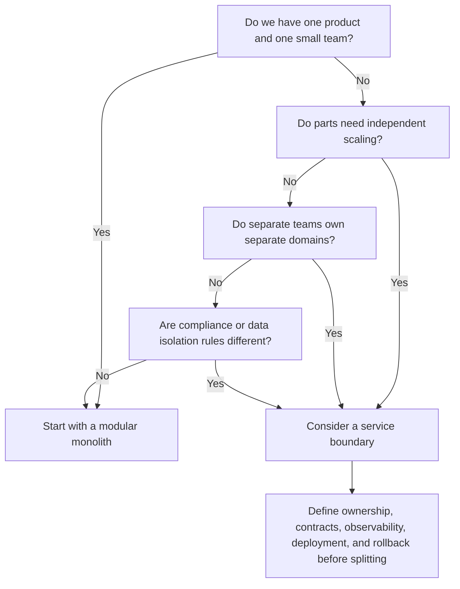

# Blog Post Deliverable

## Phase 1: Editor's Gate

✅ **Strong angle** — the post has a sharp, contrarian takeaway backed by consulting experience, concrete numbers, and a pattern engineering leads will recognize: small teams adopting microservices before they have the organizational problems microservices solve.

## Phase 2: Interview Notes

Answered from the raw notes:

- **Core opinion:** most teams should not adopt microservices.
- **Evidence base:** consulting for about a dozen mid-size companies over 5 years; maybe 2 actually needed microservices.
- **Common failure pattern:** 8-person team, one product, 15 services, 40% of engineering time spent on infrastructure plumbing.
- **Better default:** monolith with good module boundaries.
- **Real adoption drivers:** resume-driven development and conference-talk envy.
- **Legitimate use cases:** independent scaling needs, genuinely separate teams of 20+ engineers, different compliance domains.
- **Audience:** engineering leads and staff engineers at mid-size companies.
- **Platform:** dev.to.

Autonomous assumption: no interview questions asked because the user cannot answer now. Missing specifics are marked with `[FILL: ...]` where they would improve credibility.

## Phase 3: Writing Plan — Self-Approved

**Hook:** Open on the recurring consulting pattern: an 8-person team with one product and 15 services spending nearly half its engineering time on plumbing instead of customer value.

**Sections:**

1. **The pattern I keep seeing** — establishes credibility and the repeated failure mode without abstract throat-clearing.
2. **Microservices are an organizational tool, not a maturity badge** — reframes the decision around team and scaling needs.
3. **The hidden tax shows up immediately** — names the actual costs: service mesh, tracing, contract tests, deploy coordination, local dev, and ownership gaps.
4. **A modular monolith is usually the better move** — gives readers a practical alternative that preserves most benefits.
5. **When microservices actually earn their keep** — gives clear decision criteria so the post is not anti-microservices dogma.

**Takeaway:** Start with a modular monolith unless you can name the specific independent scaling, team-ownership, or compliance boundary that forces services apart.

**Visuals:**

1. **Comparison table** — replaces several paragraphs contrasting a modular monolith with premature microservices.
2. **Mermaid decision flow** — gives engineering leads a quick adoption test they can reuse in architecture discussions.

Plan self-approved per task instructions.

## Title

Most Teams Don’t Need Microservices. They Need Boundaries.

## Alternate Titles

1. Your 8-Person Team Probably Doesn’t Need 15 Services
2. Microservices Are Not a Maturity Badge

## Post

The first warning sign is usually not latency, scale, or some dramatic database incident.

It is a calendar.

An 8-person engineering team has one product, one roadmap, and somehow 15 services. Standup is mostly about broken staging environments. Half the pull requests are YAML. Someone is trying to explain why service A cannot deploy until service C updates a contract test, except service C’s owner is on vacation, and service B is failing health checks for reasons that are “probably mesh-related.”

I have seen versions of this story repeatedly while consulting for mid-size companies over the last 5 years. Across roughly a dozen teams, maybe 2 had a real need for microservices. The rest did not have a scaling problem. They had a boundaries problem, and they solved it by buying themselves a distributed systems problem.

Microservices can be right. They are also one of the easiest ways for a mid-size company to slow itself down while feeling sophisticated.

### Microservices solve organizational problems

The best case for microservices is not “the codebase is getting big.” Big codebases are annoying, but size alone is not the issue. The real question is whether different parts of the system need to move independently.

Do they need to scale independently?

Do they belong to genuinely separate teams with separate roadmaps?

Do they live under different compliance, data retention, or security rules?

If the answer is yes, services might earn their keep. If the answer is no, microservices often become architecture theater: lots of ceremony, lots of diagrams, not much customer value.

A monolith can be messy. A bad monolith can turn every change into archaeology. But splitting a messy monolith into services does not remove the mess. It gives the mess a network.

Now your unclear domain boundaries are API boundaries. Your accidental coupling is retry logic. Your “who owns this?” problem is spread across Slack and dashboards.

### The 40% infrastructure tax

The common pattern I have seen looks like this: a small team starts with one product, then splits it into many services because microservices feel like the next responsible step.

Soon, they need service discovery. Then distributed tracing. Then centralized logging that actually correlates requests. Then contract tests. Then local development tooling. Then a better CI/CD setup. Then deployment orchestration. Then a service mesh, because at this point why not add another layer of magic between the code and the thing it is trying to talk to?

None of these tools are bad. In the right environment, they are necessary. But they are not free.

In one recurring version of this pattern, a team of about 8 engineers ends up spending around 40% of its engineering time on infrastructure plumbing instead of product work. Not because the engineers are careless. Because they chose an architecture that requires a platform team before they had enough people to staff one.

That is the part conference talks tend to skip.

The demo shows independent deployment. It does not show Tuesday afternoon, when three engineers are debugging whether a failed checkout is caused by application code, a stale schema, a broken mock, or a network policy.

### The unflattering reasons teams choose them

The public reasons usually sound good:

- “We need to scale.”
- “We need team autonomy.”
- “We need better reliability.”
- “We are modernizing the platform.”

Sometimes those reasons are real. Often, underneath them, there are two quieter forces: resume-driven development and conference-talk envy.

Resume-driven development is what happens when architectural choices are optimized for what engineers want to have used, not what the product needs. Nobody gets excited about saying, “I improved module boundaries in a monolith.” Plenty of people get excited about saying, “I led a microservices migration.”

Conference-talk envy is similar. We hear how large companies run hundreds or thousands of services and forget that those companies also have platform teams, SRE teams, internal tooling teams, and organizational scale that most mid-size companies do not.

Copying the architecture without copying the organization is how you get the bill without the benefit.

### The boring alternative that usually works

For most teams, the better answer is a modular monolith.

Yes, the name is less glamorous. Nobody puts “successfully avoided unnecessary distributed systems” on a keynote slide. They should.

A modular monolith means you keep deployment simple while taking boundaries seriously. You define clear modules around business capabilities. You make dependencies explicit. You stop letting every part of the codebase reach into every other part like a raccoon in a trash can.

The goal is not “one giant folder called `services`.” The goal is internal structure that lets teams reason locally.

A good modular monolith gives you most of what people wanted from microservices in the first place:

| What teams want | Premature microservices often create | Modular monolith alternative |
| --- | --- | --- |
| Clear ownership | Many repos with unclear runtime ownership | Clear module owners inside one deployable system |
| Independent change | Distributed coordination and contract drift | Internal APIs and module-level tests |
| Better reliability | More network failure modes | Fewer moving parts and simpler rollback |
| Faster delivery | CI/CD, tracing, mesh, and deployment overhead | One pipeline with strong boundaries |
| Future flexibility | Expensive early extraction | Extract only the module that proves it needs independence |

The last row matters most. A modular monolith does not prevent future microservices. It makes future extraction easier because the boundaries are already real.

If a module has a clear interface, limited dependencies, and its own data ownership rules, extracting it later is a project. If your “module” is just vibes and import statements, extracting it later is a hostage negotiation.

### When microservices make sense

Microservices are not the villain. Premature microservices are.

They start making sense when the pain of staying together exceeds the cost of being distributed. In practical terms, I look for at least one of these conditions:

1. **Independent scaling is real.** One part of the system has load, latency, or availability needs that are meaningfully different from the rest.
2. **Teams are genuinely separate.** Not “we might hire more people someday,” but multiple teams with their own roadmaps, ownership, and release cadence. As a rough line, this often starts becoming plausible around 20+ engineers, not 8.
3. **Compliance boundaries are different.** Certain data, workflows, or systems need stricter controls, isolation, auditing, or retention rules.

Here is the test I wish more teams used before creating another service:

That final box is doing a lot of work. A service boundary is not just a repo. It is ownership, contracts, observability, deployment, rollback, security, and operational responsibility.

If you are not ready to own those things, you are not ready for the service.

### A better default

Engineering leaders do not need to ban microservices. They need to make them prove their case.

Before splitting a system, ask:

- What specific problem gets easier after this becomes a separate service?
- What new failure modes are we accepting?
- Who owns this service in production?
- How will we test contracts between services?
- How will we trace a request across boundaries?
- What happens when this service is down?
- Could a stronger module boundary solve 90% of the problem?

That last question saves a lot of pain.

Most teams do not need fewer files in one repo. They need clearer boundaries, better tests around those boundaries, and the discipline to keep modules from bleeding into each other.

Start there.

If the monolith is still the bottleneck after that — if scaling, team ownership, or compliance truly demands separation — you will be in a much better position to split it. You will know where the boundary belongs. You will know what contract it needs. You will know who owns it.

And if that day never comes, congratulations. You shipped features instead of operating a tiny distributed system tribute band.

## Editor's Notes

### `[FILL: ...]` items only the user can supply

- `[FILL: one anonymized company story with industry/context]` — a brief concrete example would make the hook more vivid without exposing a client.
- `[FILL: how the 40% engineering-time estimate was measured]` — sprint allocation, ticket categories, calendar audit, or stakeholder estimate.
- `[FILL: one example of a team that truly did need microservices]` — useful contrast for credibility.

### Visuals to create

1. **Comparison table:** included in the post; no designer needed.
2. **Decision flow:** included as Mermaid. For dev.to, verify Mermaid rendering support for the target publishing setup; if unsupported, export the flow as an image and replace the code block with `[IMAGE: decision flow showing when to choose modular monolith vs microservice boundary]`.

### Social sharing summary

Most mid-size teams do not need microservices; they need strong module boundaries, a simpler deploy path, and a higher bar before accepting distributed-systems overhead.
