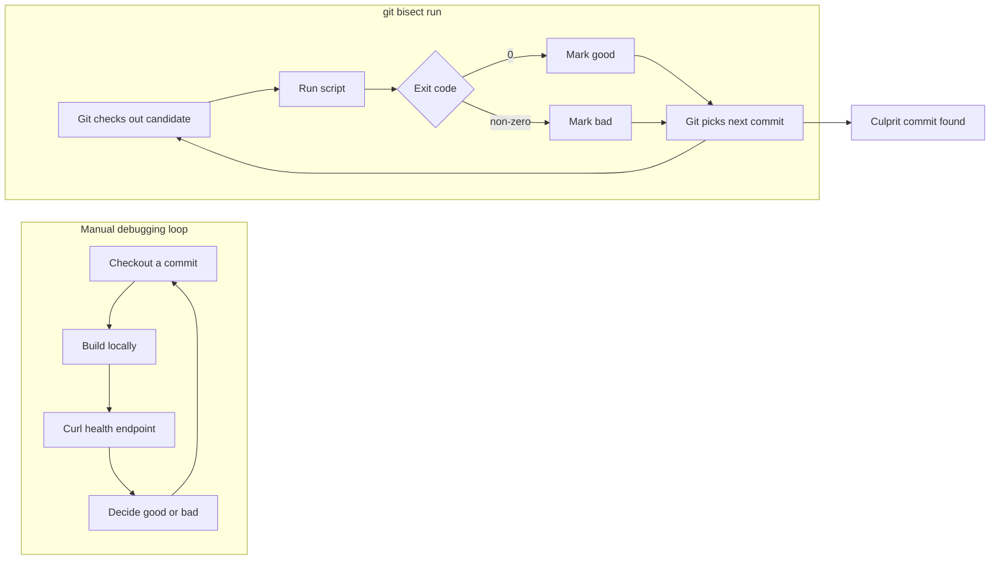

# Phase 1: Editor's Gate

✅ **Strong angle** — the post has a concrete developer payoff, a relatable production-adjacent failure hunt, and hard numbers: three manual hours became four automated minutes across roughly 200 commits.

# Phase 2: Interview Notes

No interview questions asked because the requester is unavailable. Already answered: topic, audience, platform, incident, before/after timing, approximate commit range, tool, command, script behavior, and outcome.

Missing details are marked with `[FILL: ...]` where only the author can supply specifics.

# Phase 3: Writing Plan — Self-Approved

**Hook:** Start with the pain of spending three hours manually checking out commits to find the staging deploy breaker.

**Sections:**

1. **The slow way I was doing it** — establish the relatable mistake: manual checkout, build, test, repeat.
2. **The teammate's small correction** — introduce `git bisect run` as the turning point, without making it sound like magic.
3. **How `git bisect run` thinks** — explain good/bad commits, exit codes, and binary search in plain language.
4. **The health-check script** — show a trimmed script pattern readers can adapt.
5. **What I changed after this** — end with a practical habit: automate the yes/no question before starting a long hunt.

**Takeaway:** If you can express “good” versus “bad” as a command exit code, Git can search the commit history for you.

**Visuals:**

1. Mermaid diagram showing manual commit testing versus `git bisect run`; it replaces several paragraphs of process explanation.
2. No screenshots needed; the key artifact is the script pattern, not UI output.

# Titles

**Title:** TIL: `git bisect run` Can Turn a Three-Hour Debug Hunt Into Four Minutes

**Alternate 1:** I Manually Tested 200 Commits, Then Learned Git Could Do It for Me

**Alternate 2:** Stop Babysitting `git bisect`: Let `git bisect run` Do the Loop

# Post

Yesterday I spent three hours doing something Git was perfectly happy to do for me.

A staging deploy had broken somewhere in a stretch of roughly 200 commits. I knew an older commit worked. I knew the current commit did not. So I did what felt obvious at the time: checked out a commit, built locally, hit the health endpoint, made a note, and repeated the process.

It was not my finest workflow. It was more like binary search cosplay, except I was the computer and the computer was watching patiently.

A teammate saw what I was doing and said, “You know `git bisect` can run the test for you, right?”

I did not know that. Or, more honestly, I had heard of `git bisect` and mentally filed it under “useful Git things I will learn during a calmer week,” which is a risky category because calmer weeks are fictional.

The command was this:

```bash
git bisect run <script>
```

That one line turned my three-hour commit hunt into about four minutes and eight automatic steps.

## The manual loop I was stuck in

The broken deploy had a simple shape: at some point, the app stopped passing a staging-style health check after a local build. That meant every commit had a yes/no answer.

Good commit: build succeeds, health endpoint responds.

Bad commit: build fails, app fails to start, or the health endpoint returns an error.

I was already doing the right kind of test. I was just doing the steering manually.

My loop looked roughly like this:

```bash
git checkout <some-commit>
[FILL: actual build command]
curl -fsS [FILL: exact local health endpoint]
```

Then I would decide whether that commit was good or bad and pick another commit somewhere in the remaining range.

That is the exact job `git bisect` exists to do. It performs a binary search through history. You mark one known-good commit and one known-bad commit, and Git checks out commits in the middle until it narrows the range to the first bad one.

I knew that part in theory. The part I missed was that I did not have to sit there and answer Git each time.

## The useful bit: exit codes

`git bisect run` works if you can turn your test into a script with normal Unix-style exit codes:

- exit `0` means the commit is good
- any non-zero exit means the commit is bad

That is it. Git checks out a candidate commit, runs your script, reads the exit code, records the commit as good or bad, and moves to the next candidate.

[IMAGE: Simple flow diagram comparing the manual loop with the automated `git bisect run` loop. Show manual path as checkout → build → curl → human decides → repeat. Show automated path as git checks out commit → script exits 0/non-zero → git chooses next commit → culprit found.]



Once a teammate pointed that out, the rest was embarrassingly straightforward.

## The script was not fancy

The script did not need to understand our whole deployment system. It only needed to answer one question reliably:

> Does this commit produce a locally running app whose health endpoint responds successfully?

A trimmed version looked like this:

```bash
#!/usr/bin/env bash
set -euo pipefail

[FILL: actual build command]
[FILL: command to start the app locally in the background]

curl -fsS [FILL: exact local health endpoint] >/dev/null
```

Because `set -e` stops the script when a command fails, a build failure or a failed `curl` naturally becomes a non-zero exit. That tells Git, “this commit is bad.” If everything succeeds, the script reaches the end and exits `0`, which tells Git, “this commit is good.”

In a real script, I would also make sure the local server is cleaned up between runs. If the app starts a background process, add a trap so each bisect step begins cleanly:

```bash
#!/usr/bin/env bash
set -euo pipefail

cleanup() {
  if [[ -n "${APP_PID:-}" ]]; then
    kill "$APP_PID" || true
  fi
}
trap cleanup EXIT

[FILL: actual build command]
[FILL: command to start the app locally] &
APP_PID=$!

[FILL: command or sleep that waits until the app is ready]
curl -fsS [FILL: exact local health endpoint] >/dev/null
```

The important thing is not the exact script. The important thing is that the script is deterministic enough for Git to trust.

If the health check is flaky, `git bisect run` will faithfully automate your confusion. That is still automation, technically, but not the kind that makes your day better.

## The full flow

The bisect session starts with two anchors: one commit you know is bad and one commit you know is good.

```bash
git bisect start
git bisect bad HEAD
git bisect good <known-good-commit>
```

Then hand Git the script:

```bash
git bisect run ./check-health.sh
```

From there, Git does the repetitive part. It checks out a commit, runs the script, uses the exit code, and keeps narrowing the search space.

In my case, the search covered roughly 200 commits. Instead of continuing my manual routine, Git found the culprit in about eight automatic steps.

That number is the whole reason this matters. Binary search gets small fast. Two hundred commits sounds like a long afternoon when you are testing them by hand. To Git, it is only about eight questions.

## What I learned

The lesson was not just “use `git bisect`,” although yes, use `git bisect`.

The bigger lesson was this: before you manually repeat a debugging step, ask whether the step can be turned into a yes/no command.

Can this commit build?

Does this test pass?

Does this endpoint return 200?

Does this command reproduce the bug?

If the answer can be represented as exit `0` or non-zero, you probably have something `git bisect run` can automate.

That changes the shape of the work. Instead of spending your attention on checkout/build/test bookkeeping, you spend it on making the test accurate. Once the test is trustworthy, Git can do the boring part at machine speed.

I still lost three hours yesterday. I am choosing to call that tuition.

The next time I know one commit is good, another commit is bad, and there are a pile of commits between them, I am not going to play human binary search again. I am going to write the smallest script that can tell good from bad, then let Git run the hunt.

# Editor's Notes

## `[FILL: ...]` items only the author can supply

- `[FILL: actual build command]`
- `[FILL: command to start the app locally in the background]`
- `[FILL: command to start the app locally]`
- `[FILL: command or sleep that waits until the app is ready]`
- `[FILL: exact local health endpoint]`
- `[FILL: exact known-good commit]` if you want the setup commands to use a real commit instead of `<known-good-commit>`

## Visuals to create

1. **Process diagram:** Use the included Mermaid diagram, or recreate it as a clean two-column graphic for dev.to. Left side: manual loop. Right side: `git bisect run` loop. Emphasize that the same test moves from human-driven to Git-driven.

## Social summary

I spent three hours manually hunting the commit that broke staging; `git bisect run` found it in four minutes once I turned the health check into a script with exit codes.
