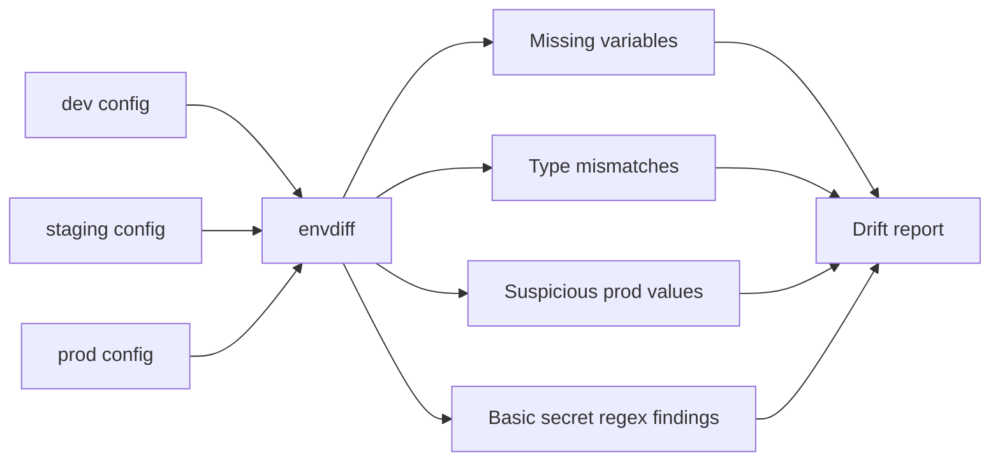

# Blog-editor deliverable

## Phase 1: Editor's Gate

✅ **Strong angle** — the post has a concrete incident, a specific tool, measurable traction, and an honest limitation set, which makes it more useful than a generic "keep env vars in sync" article.

## Phase 3: Writing Plan — self-approved

**Hook:** A production incident caused by a missing `REDIS_URL` shows how small config drift can become a real outage.

**Sections:**

1. **The bug was not in the code** — opens with the incident and frames config drift as the real problem.
2. **What envdiff checks** — explains missing variables, type mismatches, and suspicious production values in practical terms.
3. **Why I kept it boring** — covers the Go single-binary, no-dependency design and why that matters for CI and DevOps workflows.
4. **What it catches before prod does** — shows realistic examples of drift across dev/staging/prod.
5. **What is missing and where contributors can help** — names current limitations and invites useful contributions.

**Takeaway:** Treat environment configuration like something worth diffing before deployment, not like a pile of sticky notes taped to your release process.

**Visuals:**

1. Mermaid flow diagram showing configs moving through envdiff and producing drift findings; it replaces a long process explanation.
2. Screenshot placeholder for real `envdiff` CLI output; readers need to see the tool's output shape before trying it.

**Approval:** Self-approved because the user requested autonomous completion and cannot answer interview questions right now.

## Titles

**Recommended title:** The Prod Bug Was a Missing Env Var, So I Built a CLI to Catch Config Drift

**Alternate 1:** I Built `envdiff` After a Production Incident That Wasn't Really a Code Bug

**Alternate 2:** Stop Letting Dev, Staging, and Prod Quietly Drift Apart

## Post

The production incident started with one missing line.

Not a race condition. Not a heroic distributed systems failure. Not the kind of bug that earns a diagram on a whiteboard and three people saying, "Well, technically..."

Production was missing `REDIS_URL`.

Staging had it. The app expected it. The deploy went out anyway. Then production did what production does best: it turned a tiny configuration difference into a much louder problem.

That incident stuck with me because it felt so avoidable. We had reviews. We had CI. We had deployment stages. We had all the ceremony that makes software feel supervised. But nobody had asked the very plain question: "Are the environment configs actually the same where they need to be?"

So over a few weekends, I built `envdiff`, an open-source CLI that diffs environment configuration across deployment stages and flags drift before it becomes a production surprise.

It is about 800 lines of Go, ships as a single binary, and has no dependencies. Two months after putting it on GitHub, it has 340 stars, which is both encouraging and a little alarming. Apparently I am not the only person who has been personally victimized by environment variables.

[FILL: GitHub repository URL]

### Config drift is quiet until it is not

Most teams already compare code. We compare branches, commits, dependencies, Terraform plans, database migrations, and API schemas.

But environment config often gets treated differently. It lives in `.env` files, JSON blobs, deployment settings, secret managers, CI variables, platform dashboards, and occasionally one person's memory, which is the least durable storage backend available.

Drift happens when those environments stop matching in ways that matter.

A missing variable is the obvious one:

```env
# staging
REDIS_URL=redis://staging-redis:6379

# prod
# REDIS_URL is missing
```

But there are sneakier versions too.

One stage has `FEATURE_CHECKOUT_V2=true`, another has `FEATURE_CHECKOUT_V2="true"`. One config treats `WORKER_COUNT` as a number, another as a string. One production file still points at `localhost`, which is rarely a sentence that ends well.

None of these differences looks dramatic in isolation. That is the problem. They hide in plain sight until the exact runtime path needs them.

`envdiff` is my attempt to make that boring failure mode visible.

### What envdiff does

At its core, `envdiff` compares config across stages like `dev`, `staging`, and `prod`.

It currently supports `.env` files and JSON configs. You point it at the files for each environment, and it reports drift such as:

- variables present in one stage but missing in another
- type mismatches between JSON config values
- suspicious values in production, such as `localhost`
- basic secret-looking strings caught by regex rules

The goal is not to become a full policy engine. It is to answer a smaller question quickly: "What changed between environments that might hurt me later?"

A typical workflow should feel lightweight enough to run before a deploy or inside CI.

```bash
[FILL: actual envdiff command, flags, and preferred example invocation]
```

And the output should be direct enough that the next action is obvious.

[IMAGE: Screenshot of real envdiff terminal output comparing dev, staging, and prod. It should show at least one missing variable, one suspicious production value such as localhost, and one type mismatch. Use the actual CLI colors and formatting.]

```text
[FILL: paste real envdiff output from the screenshot here for accessibility]
```

### The shape of the check

The mental model is intentionally simple.

[IMAGE: Simple flow diagram showing dev, staging, and prod config files going into envdiff, then envdiff producing a drift report with missing vars, type mismatches, suspicious values, and basic secret findings.]



There is no service to run. No dashboard to babysit. No database. No agent sitting in your cluster asking for more permissions than you are emotionally prepared to grant.

It is a CLI. You run it. It tells you where the configs disagree.

That design came from the incident. The missing `REDIS_URL` was not a problem that needed a platform. It needed a cheap, repeatable check that would have failed before the deploy reached production.

### Why I kept it boring

I wrote `envdiff` in Go partly because I wanted a single binary that people could drop into a repo, CI job, or release checklist without negotiating a dependency tree.

The tool is small on purpose: roughly 800 lines, no dependencies, and focused on config comparison rather than workflow ownership.

That matters because DevOps tools often fail socially before they fail technically. If the first step requires a new service, a database, a lengthy setup guide, and three calendar invites, the tool is already fighting uphill.

A binary that can run in CI has a better chance of becoming habit.

For example, a team could add `envdiff` as a pre-deploy check:

```bash
[FILL: CI example command or GitHub Actions snippet]
```

If production is missing a required variable, fail the build. If a production URL points to `localhost`, make someone look at it before the deploy. If staging and prod disagree on a type, surface it while everyone is still calm.

Software is much easier to fix before it becomes an incident channel.

### What it catches before prod does

The most useful checks are the ones that sound almost too obvious.

A variable exists in staging but not production. That is obvious.

A production value contains `localhost`. Also obvious.

A JSON field is a number in one environment and a string in another. Painfully obvious.

But obvious after the fact is not the same as obvious during release.

That is the gap `envdiff` is trying to close. It gives you a focused report at the moment you can still do something about it.

The tool is especially useful when multiple people or systems can change configuration. Maybe backend developers own the app defaults, DevOps owns deployment settings, and CI owns injected variables. Everyone can be doing reasonable things and still produce an unreasonable final config.

Diffing those environments gives the team a shared artifact. Instead of "I think prod has the same vars," you get "prod is missing `REDIS_URL`, `API_TIMEOUT` changed type, and `SEARCH_ENDPOINT` points to localhost."

That is a much better conversation.

### What it does not do yet

`envdiff` is useful, but it is not pretending to be finished.

Right now it only supports `.env` files and JSON configs. YAML support is not there yet, which I know will be a dealbreaker for some teams. Secret scanning is also basic regex today, so it should be treated as a helpful warning system, not a replacement for a dedicated secrets scanner.

Those limitations are part of why I am sharing it now.

If you work with DevOps workflows, backend services, release engineering, or config-heavy systems, I would love for you to try it and tell me where it breaks down. Better yet, contribute the missing pieces.

The areas that would help most:

- YAML support
- stronger secret detection
- better CI examples
- more real-world config edge cases
- clearer output formats for automated checks

[FILL: contribution guidelines URL or preferred contribution instructions]

The bigger lesson for me was not that every team needs this exact tool. It is that environment drift deserves the same boring, repeatable checks we already expect for code.

If a missing config value can take production down, it should not live outside the safety net.

Run a diff before prod does it for you.

## Editor's notes

### `[FILL: ...]` items only the author can supply

- `[FILL: GitHub repository URL]`
- `[FILL: actual envdiff command, flags, and preferred example invocation]`
- `[FILL: paste real envdiff output from the screenshot here for accessibility]`
- `[FILL: CI example command or GitHub Actions snippet]`
- `[FILL: contribution guidelines URL or preferred contribution instructions]`

### Visuals to create

1. **CLI output screenshot:** Capture real terminal output from `envdiff` comparing dev, staging, and prod. Include examples of a missing variable, a suspicious production value, and a type mismatch.
2. **Config flow diagram:** Use the included Mermaid diagram or render it as an image for Dev.to if Mermaid rendering is not desired.

### One-line social summary

I built `envdiff`, a small Go CLI for catching environment config drift, after a production incident caused by one missing `REDIS_URL`.

### Revision offer

One round of revisions recommended after the author fills the command, output, repository, and contribution details.
