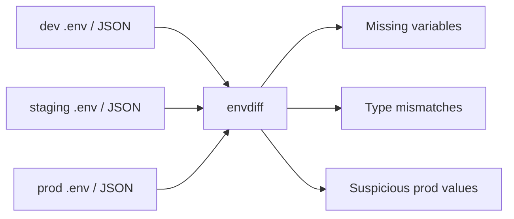

# Blog Editor Deliverable: envdiff Showcase Post

## Phase 1: Editor's Gate

✅ **Strong angle** — this is a credible **Showcase / plug** with a war-story spine: a real production incident makes the tool feel necessary, while the small scope, clear constraints, and early traction make the ask believable.

- **Single concrete takeaway:** Environment drift is easy to miss and cheap to catch before deploys; `envdiff` gives teams a lightweight way to compare dev/staging/prod config and spot risky differences.
- **Reader:** DevOps engineers and backend developers who own deployments, CI checks, app configuration, or production readiness.
- **Why they care:** A missing config value can take production down even when staging looked fine.
- **Angle that is not generic:** This is not “configuration matters”; it is “a missing `REDIS_URL` caused an incident, so I built an 800-line Go CLI to catch that exact class of drift.”

## Phase 3: Self-Approved Writing Plan

**Archetype:** Showcase / plug, borrowing from war story. The post should promote `envdiff` honestly by leading with the production pain, showing what the tool catches, and naming limitations without hand-waving.

**Working title:** Why I Built a Tiny CLI to Catch Environment Drift Before Prod Does

**Hook:** A production deploy failed because `REDIS_URL` existed in staging but not in prod — the kind of boring config drift that feels obvious only after it has already hurt.

**Sections:**

1. **The incident was boring, which made it worse** — opens with the missing `REDIS_URL` and frames environment drift as a practical deployment risk.
2. **The check I wanted was smaller than a platform** — explains the desired workflow: compare dev/staging/prod config files and flag missing variables, type mismatches, and suspicious prod values.
3. **What envdiff catches today** — shows concrete examples of drift categories and gives readers enough to decide if it fits their stack.
4. **Small on purpose, honest about limits** — covers Go, single binary, no dependencies, ~800 lines, plus current support for `.env` and JSON only and basic regex secret scanning.
5. **Try it, break it, improve it** — invites DevOps/backend readers to test it, contribute YAML support or better scanning, and add config drift checks to their own deploy path.

**Takeaway:** You do not need a huge governance system to start catching dangerous config drift; even a small CLI check can make production mismatches visible before they become incidents.

**Visuals:**

1. **Mermaid flow diagram** showing app config files moving through `envdiff` into categorized drift findings. This replaces a long workflow explanation.
2. **Screenshot placeholder** of sample CLI output showing missing var, type mismatch, and suspicious prod value. This gives readers the product feel without inventing exact output.
3. **Small support/limitations table** in the post. This makes the current scope clear and credible.

Self-approval: approved to draft autonomously because the user cannot answer interview questions and requested reasonable assumptions plus `[FILL: ...]` markers.

## Three Title Options

1. **Recommended — Why I Built a Tiny CLI to Catch Environment Drift Before Prod Does**  
   Strategy: why-trigger + clear problem. This is the one I'd run with because it promises a story and a practical tool without overselling.

2. **The 800-Line Go Tool I Built After One Missing REDIS_URL Broke Prod**  
   Strategy: number + concrete incident. Stronger story hook, but slightly more “war story” than “showcase.”

3. **How envdiff Finds Dev/Staging/Prod Config Drift Before Deploys Bite Back**  
   Strategy: how-trigger + utility promise. Best if the goal is searchability and immediate product clarity.

## Post

# Why I Built a Tiny CLI to Catch Environment Drift Before Prod Does

A production incident sent me looking for the kind of bug that never looks impressive in a postmortem.

`REDIS_URL` existed in staging. It did not exist in production. The app expected it, the deploy made it through, and production reminded us that “works in staging” is not a binding contract.

There was no exotic distributed-systems failure hiding in the logs. No heroic tale of packet loss, clock skew, or a database slowly melting into soup. Just one missing environment variable in the one place where missing environment variables matter most.

So over a few weekends I built `envdiff`: a small open-source CLI that diffs environment configs across deployment stages and flags drift before prod gets the final vote.

It is written in Go, about 800 lines, ships as a single binary, and has no dependencies. Two months after publishing it, it has 340 GitHub stars, which is both exciting and a little suspicious because config drift is not exactly a party trick.

Apparently a lot of us have been bitten by boring config bugs.

[FILL: GitHub repository URL]

## The incident was boring, which made it dangerous

The frustrating part about config drift is that every individual mismatch can look reasonable in isolation.

Development has `DEBUG=true`. Staging points at a test Redis instance. Production uses a real cache endpoint and stricter timeouts. That is normal. Environments should differ.

The problem is when they differ silently.

A missing key, a string where production expects a number, or a value like `localhost` hiding in prod config can sit there unnoticed until the exact code path wakes it up. By then you are no longer reviewing a diff. You are watching alerts and trying to remember which deploy changed what.

After the `REDIS_URL` incident, the check I wanted was not a new platform. I did not want a dashboard, a policy language, or another service that needed its own onboarding meeting.

I wanted to run one command and get a blunt answer:

> “Here is how dev, staging, and prod config differ. These differences look risky.”

That became the shape of `envdiff`.

## The check I wanted was smaller than a platform

`envdiff` compares config files across deployment stages and groups the differences into things a human can act on.

At a high level, the flow is simple:

The goal is not to decide whether every difference is wrong. A tool cannot know that `FEATURE_X_ENABLED=true` in staging and `false` in prod is intentional unless you teach it your release process.

The goal is to make risky drift visible at the point where it is cheapest to discuss: before the deploy, during review, or inside CI.

The first version focuses on three categories.

### Missing variables

This is the `REDIS_URL` class of problem.

If staging has a key and production does not, `envdiff` calls that out. Same for dev versus staging, depending on which files you compare. Not every missing variable is a bug, but missing required config is one of those issues that should have to explain itself.

[IMAGE: Screenshot of envdiff output showing a missing REDIS_URL in prod while staging contains it. Include the command invocation and a short, readable table of findings.]

### Type mismatches

Config files are text, but applications rarely treat them that way.

A timeout that is `30` in one environment and `"30s"` in another may be perfectly fine, or it may be a deploy waiting to fail. A boolean-looking value that changes shape between stages deserves the same attention.

`envdiff` does not pretend to understand your entire application. It looks for mismatches that are cheap to detect and worth a human glance.

### Suspicious production values

Some values are allowed in development and almost never okay in production.

`localhost` is the obvious example. So are placeholder-looking values, depending on your conventions. The current scanning is intentionally basic regex, which means it is useful as a tripwire, not as a security product.

That distinction matters. I do not want anyone treating a small weekend CLI as a replacement for secret scanning, policy enforcement, or config management. `envdiff` is a flashlight. Sometimes that is exactly what you need.

## Small on purpose, honest about limits

The best compliment I can give a CLI is that I can understand when to use it and when not to.

`envdiff` is deliberately small:

| Area | Current state |
| --- | --- |
| Implementation | Go, about 800 lines |
| Distribution | Single binary |
| Dependencies | None |
| Supported config | `.env` files and JSON configs |
| Drift checks | Missing vars, type mismatches, suspicious values |
| Secret detection | Basic regex only |
| Not supported yet | YAML |

That scope is part of the appeal. You can run it locally, wire it into CI, or use it during a review without adopting a new system.

It is also where the limitations are.

If your team stores most config in YAML, `envdiff` is not ready for your main path yet. If you need deep semantic validation or serious secret detection, this is not that tool. If your environments are generated dynamically from several sources, you may need to export them into `.env` or JSON first.

I am calling those out because developer tools earn trust by being clear about their edges. The fastest way to make a useful tool feel sketchy is to pretend it solves the entire category.

It does not.

It catches a narrow set of mistakes that I have seen cause real pain.

## Where it fits in a deployment workflow

The most natural place for `envdiff` is before production deploys.

For a small team, that might mean running it by hand before a release. For a larger team, it could be a CI check that compares the configuration snapshots used by staging and prod and posts the drift in a pull request or build log.

[FILL: exact install command]

[FILL: exact example command for comparing dev, staging, and prod files]

I would start with a non-blocking check. Let it report drift for a week or two. See which warnings are noise, which ones are real, and which differences your team considers intentional.

Then decide what should fail a build.

That gradual approach matters because config is full of legitimate exceptions. A tool that blocks everything on day one becomes another angry robot in the pipeline. A tool that makes invisible risk visible gives the team a chance to build shared rules.

The real win is not that `envdiff` knows your production environment better than you do. It does not. The win is that it forces config drift into the open while there is still time to talk about it calmly.

## Try it, break it, improve it

I built `envdiff` because I wanted the simplest possible guardrail after a very avoidable incident.

The early response has been encouraging: 340 stars in two months, issues from people trying it against their own config setups, and enough interest that the next obvious improvements are already clear.

YAML support is the big one. Better secret scanning would also help, as long as it stays honest about what lightweight scanning can and cannot prove. I am also interested in examples of drift categories that have caused real incidents for other teams.

[FILL: contribution guidelines or “good first issue” link]

If you are a DevOps engineer or backend developer who has ever said “but it worked in staging” with a straight face, give `envdiff` a try against one service this week.

Do not start by boiling the ocean. Pick one app. Compare dev, staging, and prod. Look for missing variables, type mismatches, and values that obviously do not belong in production.

If it finds nothing, great. You bought a little confidence.

If it finds something weird, even better. That is the whole point: weird config should be a review comment, not a production surprise.

What kind of environment drift has bitten your team: missing keys, wrong types, suspicious values, or something stranger?

## Editor's Notes

### Phase 5 fresh-eyes review summary

I performed the required separate-pass review myself because nested subagent delegation was not available under the operating constraints. Mechanical issues, banned phrases, and markdown structure were checked and corrected during polish.

### `[FILL: ...]` items only the user can supply

- `[FILL: GitHub repository URL]`
- `[FILL: exact install command]`
- `[FILL: exact example command for comparing dev, staging, and prod files]`
- `[FILL: contribution guidelines or “good first issue” link]`

### Reviewer flags needing user judgment

- The incident is compelling but sparse. If you can share one non-sensitive detail about impact — downtime, failed job, customer-facing symptom, or time to diagnose — the hook will get stronger.
- The draft avoids inventing CLI syntax. Add the real command and output before publishing so the showcase feels concrete.
- If `no deps` means “no third-party Go modules” rather than “no runtime dependencies,” clarify that wording.

### Visuals to create

1. **Mermaid diagram:** included in the post; render as-is on dev.to if supported, or convert to an image if preferred.
2. **CLI screenshot:** capture a real `envdiff` run showing one missing variable, one type mismatch, and one suspicious prod value such as `localhost`.
3. **Support/limitations table:** included in markdown; verify the rows match the current repo before publishing.

### One-line social summary

I built `envdiff`, an 800-line Go CLI for catching dev/staging/prod config drift, after one missing `REDIS_URL` made it all the way to production.
