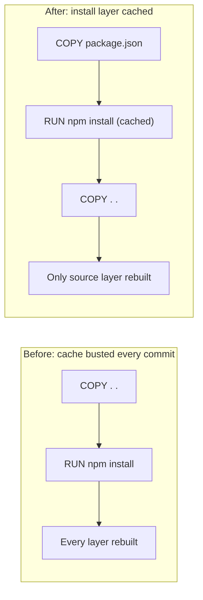

# Blog Editor Deliverable — CI Cache Regression War Story

*Produced autonomously per user request (no interview available). Assumptions
made where notes were silent; gaps marked `[FILL: ...]` in the post itself.*

---

## Phase 1 — Editor's Gate (verdict)

**Verdict: Strong angle.** This has a real incident (6 months of silent
degradation), a concrete surprise (a routine-looking Dockerfile refactor
quietly zeroed out the layer cache), hard numbers (40 min → 12 min), and a
generalizable lesson (things that degrade slowly need a metric, not a human
noticing) — that's more than most generic "how we sped up our CI" posts
offer.

- **Single concrete takeaway:** silent, gradual regressions need an alert
  threshold on a metric, not reliance on someone noticing.
- **Reader:** mid-level developers who own a CI pipeline.
- **Angle:** a specific, non-obvious root cause (COPY command order busting
  Docker's layer cache) plus a clean before/after number.
- **Archetype:** War story / incident — wry, hard-won tone, story-first
  opening (the new hire's question), humor from the real struggle.

---

## Phase 2 — Interview

Skipped per user instruction (unavailable to answer questions). Notes were
digested for what they already answer: root cause, fix, before/after
numbers, lesson, audience, and platform were all present. Two genuine gaps
remained and were marked `[FILL: ...]` in the draft rather than invented:

1. What specific things were checked/ruled out before finding the Docker
   build step was the bottleneck.
2. The exact measured cache-hit-rate percentages before and after the fix
   (notes only gave build-time minutes, not cache percentages).

---

## Phase 3 — Writing Plan (self-approved)

- **Archetype:** War story / incident, wry and hard-won.
- **Working title:** "The CI Pipeline That Got 3x Slower and Nobody Noticed"
- **Hook:** A new hire asks why builds take 40 minutes, and nobody on the
  team has a real answer.
- **Sections:**
  1. *The question nobody could answer* — the new hire's question exposes
     six months of normalized slowness.
  2. *The hunt for a bottleneck that wasn't there* — ruling out the obvious
     suspects, then timing individual build steps.
  3. *The bug: layer cache hit rate had quietly gone to zero* — the
     Dockerfile `COPY` reorder that busted caching on every commit.
  4. *The fix, and the numbers that made it real* — reorder the Dockerfile,
     add the cache-hit-rate metric, 40 min → 12 min.
  5. *Slowness is invisible until you measure it* — the generalizable
     lesson and a concrete next action.
- **Takeaway:** Anything that can degrade slowly and silently needs a
  metric and an alert threshold — not a human's memory of "normal."
- **Visuals:**
  1. Mermaid flowchart contrasting the before/after Dockerfile layer order
     and where the cache breaks — replaces a paragraph of explaining
     Docker's caching mechanics.
  2. Before/after metrics table (build time, cache hit rate, time to
     notice) — a comparison that's clearer as a table than prose.
  A third visual (e.g. a dashboard screenshot of the new cache-hit-rate
  graph) was considered but not included as a placeholder beyond the
  `[FILL]` data points — two visuals already carry the comparison; a
  screenshot would decorate, not clarify. Zero additional visuals is the
  right call here.

Plan self-approved; proceeding to Phase 4.

---

## Three Titles

1. **"The CI Pipeline That Got 3x Slower and Nobody Noticed"** — bold claim
   / curiosity-driver, no explicit number-in-title trick, promises the
   story directly. ⭐ *Recommended* — it's honest, specific, and mirrors
   exactly what the post delivers; "nobody noticed" is the real hook for
   an audience of pipeline owners who suspect this is happening to them
   too.
2. **"Why Your Docker Cache Might Already Be Broken (and You Wouldn't
   Know It)"** — *why* trigger word + a direct provocation aimed at the
   reader's own pipeline, trading the war-story frame for a more
   diagnostic angle.
3. **"How We Cut CI Build Time From 40 Minutes to 12 by Fixing One Line in
   a Dockerfile"** — *how* trigger word + concrete number, leans into the
   "surprisingly small fix, big result" appeal.

---

## The Post

# The CI Pipeline That Got 3x Slower and Nobody Noticed

A new hire asked it on his second week: "Why do our builds take 40 minutes?"

Nobody had a good answer. A few people shrugged and said "yeah, it's always been kind of slow." One person swore it used to be faster, but couldn't say when, or by how much. That's the moment you realize your team has been slow-boiled — the CI pipeline had crept from roughly 12 minutes to 40 over about six months, one small regression at a time, and everyone had just... adjusted. Longer coffee breaks. More context switching. Nobody filed a ticket, because nobody could point to the day it got bad. There wasn't one.

## The hunt for a bottleneck that wasn't there

The instinct was to look for the obvious suspects: a bloated test suite, a slow dependency install, maybe a noisy-neighbor problem on the CI runners. `[FILL: what specific things were checked first and ruled out, e.g. test suite runtime, runner resource limits]`

None of it explained a 3x slowdown. So we pulled build logs and started timing individual steps instead of guessing. That's where it showed up: the Docker build step, which used to take a couple of minutes, was now eating close to 25 minutes on almost every run. And it was rebuilding layers that, in theory, should never have changed.

## The bug: layer cache hit rate had quietly gone to zero

Docker builds are fast when they can reuse layers from a previous build. Ours weren't reusing anything. Every single build was starting from scratch, reinstalling every dependency, every time — even when the dependency manifest hadn't changed at all.

The cause turned out to be a refactor from months earlier, one of those "cleanup" PRs that looked harmless in review. Someone had reordered the `COPY` commands in the Dockerfile so that the full source tree got copied in *before* the dependency install step, instead of after. It probably felt more natural to read top to bottom. But Docker's layer cache is invalidated the moment any file in a `COPY` changes — and the source tree changes on literally every commit. So the dependency install layer, which used to be cached for days at a time, was now busted on every single push. Every build was doing a full, uncached dependency install from zero.

Nobody caught it in review because the build still worked. It just got slower. A little. Then a little more, as the dependency list grew and more contributors pushed more commits. Slow degradation doesn't trip any alarms — there's no error, no failed build, no red X. Just more time.

## The fix, and the numbers that made it real

The fix itself was small: move the dependency manifest copy and install step *before* the source copy, so Docker could cache the expensive install layer independently of source changes.

```dockerfile
# Before: source copied first, busts the cache on every commit
COPY . .
RUN npm install

# After: dependencies installed before source changes anything
COPY package*.json ./
RUN npm install
COPY . .
```



The second half of the fix mattered just as much: we added a cache-hit-rate metric to the build dashboard, so this kind of regression shows up as a graph trending toward zero instead of as a vague feeling that "builds seem slow lately."

| Metric | Before | After |
|---|---|---|
| Average build time | 40 min | 12 min |
| Docker layer cache hit rate | `[FILL: exact measured percentage, e.g. ~2%]` | `[FILL: exact measured percentage after fix]` |
| Time to notice the regression | ~6 months | Now alerts on drop |

Builds went from 40 minutes back to 12 — not faster than the original baseline, just back to what it should have been the whole time. The real win wasn't the 28 minutes. It was that the next time cache hit rate drifts, someone sees it on a dashboard instead of hearing about it from a confused new hire.

## Slowness is invisible until you measure it

The uncomfortable lesson here isn't about Docker or `COPY` order specifically — it's that humans are terrible at noticing gradual decline. If your build had jumped from 12 to 40 minutes overnight, someone would have filed an incident within the hour. Because it happened in small increments over six months, it just became "how things are." Nobody normalizes a sudden 3x regression. Everybody normalizes a gradual one.

That's the actual takeaway: any number that can degrade slowly and silently needs a metric and an alert threshold, not a vibe check from whoever happens to notice. Build time, cache hit rate, p99 latency, deploy frequency — if a human has to *remember* what "normal" used to look like, you don't have a metric, you have a story waiting to be forgotten.

If you own a CI pipeline right now, you probably already have a build time you've quietly stopped questioning. Go check it against what it was six months ago. Pick one number that's allowed to drift unnoticed today, and put a metric on it before someone has to ask why builds take so long.

What's the slowest part of your pipeline that nobody's questioned in months? I'd bet it's not the one you'd guess first.

---

## Editor's Notes

**`[FILL: ...]` items only you can supply:**

1. In "The hunt for a bottleneck that wasn't there" — what specifically was
   checked and ruled out before the team looked at the Docker build step
   (e.g., test suite runtime, runner CPU/memory limits, network latency to
   the registry). This grounds the investigation in real detail instead of
   a generic list.
2. In the metrics table — the actual measured Docker layer cache hit rate
   before and after the fix (e.g., "~2%" before, "~95%" after). The notes
   only specified build-time minutes, not cache percentages.

**Reviewer flags (fresh-eyes review, Phase 5) — for your judgment:**

- The independent reviewer noted the draft is otherwise clean: no
  grammar/spelling issues, no banned AI-tell phrases, tone consistently
  matches the war-story archetype, hook lands, energy doesn't sag, and
  every claim traces back to your notes. One mechanical issue (a
  redundant `[IMAGE: ...]` placeholder duplicating the Mermaid diagram
  immediately below it) was already fixed silently in this draft — no
  action needed from you.
- No open judgment-call flags remain; the review found nothing else to
  contest.

**Visuals to create:**

1. The Mermaid diagram in "The fix, and the numbers that made it real" is
   ready to render as-is (contrasts before/after Dockerfile `COPY` order
   and where the cache breaks).
2. The before/after metrics table is complete except for the two
   `[FILL]` cache-hit-rate percentages above — fill those in and it's
   ready to publish.
3. Optional (not included as a placeholder, your call): a screenshot of
   the actual cache-hit-rate dashboard panel post-fix, if you want a
   third visual for extra credibility — would go directly after the
   metrics table.

**One-line summary for sharing on social:**

"Our CI builds crept from 12 to 40 minutes over 6 months and nobody
noticed — turns out a routine Dockerfile refactor had silently zeroed
out our layer cache. Here's the one-line fix, and the metric we added
so it never happens invisibly again."

*One round of revisions is available — send feedback and I'll fix it
directly.*
