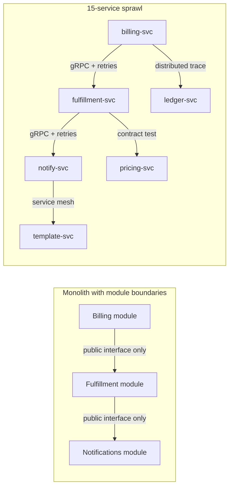

# Blog Editor Deliverable — Opinion Piece: Most Teams Don't Need Microservices

This run was completed autonomously (no interview answers available). Assumptions
are called out below; anything the user must supply is marked `[FILL: ...]`
inline in the post.

---

## Phase 1 — Editor's Gate (verdict)

**✅ Strong angle.** Concrete takeaway: engineering leads should default to a
modular monolith and adopt microservices only against specific criteria
(independent scaling, 20+ engineer org, separate compliance domains) — not by
default. Reader: engineering leads and staff engineers at mid-size companies,
likely under pressure to "modernize." What makes this different from the
hundred existing monolith-vs-microservices posts: a real consulting sample
(12 companies / 5 years, only 2 needed it) and a specific, damning number
(40% of engineering time lost to plumbing) rather than generic architecture
advice.

**Archetype:** Opinion / hot take — bold claim up front, steelman the 2-of-12
cases where it worked, concrete criteria instead of vibes.

## Phase 2 — Interview

Skipped per user instruction (user unavailable for interview). Notes were
digested in full; no genuine gaps were worth blocking on. Items not present
in the notes are marked `[FILL: ...]` in the draft rather than invented:

- A specific before/after anecdote for the "40% of time on plumbing" claim
  (e.g., how much longer a feature takes post-split, or a specific incident).
- Concrete evidence that the 2 successful microservices adopters saw payoff
  (a cost number, a velocity number) — the notes state the *criteria* for
  when it makes sense, but not a specific proof point, so an early draft's
  "paid for itself in the first year" line was cut and replaced with a
  `[FILL]` since it was not supported by the source notes.

## Phase 3 — Writing Plan (self-approved)

- **Archetype:** Opinion / hot take.
- **Working title:** "Most Teams Don't Need Microservices (And Yours Probably
  Doesn't Either)"
- **Hook:** Bold claim — 2 out of 12 consulting clients actually needed
  microservices; the rest bought themselves a distributed-systems tax.
- **Sections:**
  1. The claim + the 40%-plumbing-tax pattern (why it happens, what it costs).
  2. Steelman — the 2 that got it right, and why.
  3. The real reasons teams adopt it anyway (resume-driven development,
     conference-talk envy).
  4. The modular monolith path to 90% of the benefit (with a diagram).
  5. The actual adoption criteria — a checklist, not vibes.
- **Takeaway:** Run your team through the 3-criteria checklist before
  splitting; if none apply, invest in module boundaries instead.
- **Visuals:**
  - One Mermaid diagram contrasting a monolith with clean module boundaries
    against a 15-service sprawl — replaces a paragraph of description of
    "what plumbing looks like" with something scannable.
  - One table (signal → real need vs. vanity metric) — this is the
    checklist the whole post builds to; a reader can screenshot and use it
    directly.
  - No screenshots: there's no product/UI to show for an architecture
    opinion piece.
- Single core idea, no split needed.

---

## Three Titles

1. **"Most Teams Don't Need Microservices (And Yours Probably Doesn't
   Either)"** — bold promise + directly addresses the reader.
   **Recommended.** It's confident without overpromising, names the
   reader directly ("yours"), and matches the steelmanned, criteria-driven
   tone of the piece rather than a cheap dunk on microservices.
2. **"I've Watched 12 Companies Adopt Microservices. Only 2 Needed To."**
   — number + hard-won personal result.
3. **"Why Your 8-Person Team Doesn't Need 15 Microservices"** — trigger
   word (why) + concrete number pulled straight from the recurring pattern.

---

## The Post

# Most Teams Don't Need Microservices (And Yours Probably Doesn't Either)

Here's a number that should bother you: out of a dozen mid-size companies I've consulted for over the last five years, exactly two actually needed microservices. The other ten split up their systems anyway, and most of them are worse off for it.

If you're an engineering lead weighing this decision right now, I want to save you the five years it took me to see the pattern clearly.

## The pattern: 8 people, 15 services, 40% of their time gone

It shows up almost the same way every time. An 8-person team owns one product. Someone reads a blog post from a company operating at 100x their scale, and within two quarters the one product becomes 15 services.

Then the real cost shows up. Across the teams I've watched make this move, a consistent chunk of engineering time — somewhere around 40% — goes to keeping the distributed system alive rather than building anything new: standing up a service mesh, wiring distributed tracing so anyone can find out why a request failed, writing and maintaining contract tests between services that used to be function calls.

None of that plumbing existed when it was one codebase. It isn't optional once you split — it's the toll booth on every feature from then on. An 8-person team doesn't have 40% of a person's time to give away; they have maybe one engineer's worth of slack, total, and now that slack is gone.

One engagement made the toll booth impossible to ignore: [FILL: a specific before/after anecdote from this engagement — e.g. how long a feature that used to take 3 days now takes, or a specific incident caused by a cross-service failure].

## The two that got it right

To be fair to the other side: two of the twelve companies I worked with had real, defensible reasons to split up their systems, and it worked.

Both had a wall that a monolith genuinely couldn't get past. One needed to scale a single expensive workload — think a recommendation engine or a media-processing pipeline — completely independently from the rest of the product, because scaling everything together meant massively overpaying for infrastructure the rest of the app didn't need. The other had grown past 20 engineers split across genuinely separate teams, each shipping on their own cadence, and the coordination cost of one shared deploy had become the bigger tax.

In both cases, the reason for splitting was never in question — [FILL: specific evidence the split paid off, e.g. cost savings from independent scaling or a concrete team-velocity outcome]. That's the tell: when microservices are the right call, you don't have to squint to see the payoff.

## The real reasons the other ten did it

If independent scaling and team-size pressure explain two out of twelve, what explains the other ten? Not architecture. Ego, mostly.

The pattern I keep seeing is resume-driven development: an engineer wants "distributed systems" and "Kubernetes" on their next resume, and the codebase becomes the vehicle. Close behind it is conference-talk envy — a team hears a talk from a company at a completely different scale, and decides that's what "good engineering" looks like, without asking whether their 8-person team has anything in common with the speaker's 800-person org.

Neither of those is a technical justification. They're both solved by a better performance review process, not a new deployment topology.

## The monolith gets you 90% of the benefit anyway

Here's what almost nobody tells you: a monolith with genuinely good module boundaries gets a mid-size team the vast majority of what they wanted from microservices in the first place — team autonomy, the ability to reason about one part of the system without loading the whole thing into your head, and code that doesn't turn into a ball of mud.

```
apps/
  billing/        # owns its own tables, no other module reaches in
  fulfillment/    # talks to billing only through its public interface
  notifications/  # can be extracted later, on its own timeline
```

[IMAGE: side-by-side architecture diagram — see Mermaid below for the exact structure to render]

*(Service and module names below are illustrative, not a real client's architecture.)*



The left side has one deploy, one on-call rotation, and a compiler that stops you from violating a module boundary. The right side has all of that same logic, plus a service mesh, a tracing system, and a suite of contract tests standing between every pair of arrows — for a team that doesn't yet have the headcount to own any of it.

Enforce the module boundaries with your build tooling, not just a diagram in Notion. If nothing stops `billing` from importing `fulfillment`'s internals directly, you don't have module boundaries — you have a monolith that will eventually earn the label "distributed" without any of the benefits.

## The actual test, not the vibe check

Before you split a single service off, run your situation against three concrete criteria. If none of them apply, you're not ready — and probably won't be for a while.

| Signal | What it looks like | Real need or vanity metric? |
|---|---|---|
| Independent scaling | One workload's resource needs are wildly different from the rest (10x traffic, GPU-bound, etc.) and scaling together means overpaying significantly | Real need |
| Team topology | 20+ engineers across genuinely separate teams, each needing to deploy on their own schedule without blocking others | Real need |
| Compliance boundary | A specific subsystem has different regulatory or data-isolation requirements (e.g., PCI scope) that are cheaper to isolate physically than to firewall inside one codebase | Real need |
| "Company X does it" | You heard a talk or read a blog post from a team at a very different scale | Vanity metric |
| Resume building | An engineer wants specific tech on their next job application | Vanity metric |
| "It'll be cleaner" | The current codebase is messy, and splitting it feels like it would force better structure | Vanity metric — fix the module boundaries first; splitting a mess just gives you a distributed mess |

If your situation matches a row in the left column, you have a real case. If it only matches the right column, the fix is module boundaries and code review discipline, not a network hop.

## What to do this week

Pick your most tangled module — the one everyone's afraid to touch — and draw its actual dependency graph, not the one from the architecture diagram nobody's updated in a year. If you find imports crossing where a public interface should be, that's your real problem, and it's the same problem a microservice split would just relocate to a network call instead of fixing.

Fix the boundary first. If you still want to split it out in six months, you'll be splitting off something with a clean interface already — the easy version of a hard project, instead of the hard version of an easy one.

What's the messiest module in your codebase right now, and what's actually stopping you from drawing a clean boundary around it?

---

## Editor's Notes

**`[FILL]` items — only the user can supply these:**

1. A specific before/after anecdote or incident backing the "40% of time
   on plumbing" claim (e.g., a feature that used to ship in 3 days now
   takes N days, or a concrete cross-service failure). This sits right
   after the strongest emotional beat in the piece, so filling it well
   will materially improve the section.
2. Concrete evidence (a cost figure, a velocity outcome) that the two
   successful microservices adopters actually saw payoff — the notes
   establish *when* microservices make sense but not *proof* that it
   worked out for those two clients. An earlier draft included an
   invented claim ("paid for itself in the first year") that was not in
   the source notes; it has been replaced with this `[FILL]` rather than
   left as an unverified assertion.

**Reviewer flags (fresh-eyes review) needing your judgment:**

- The independent reviewer flagged that the invented illustrative service
  names in the diagram (`billing-svc`, `fulfillment-svc`, etc.) could be
  mistaken for a real client's architecture by a skimming reader. A
  one-line caption has been added ("Service and module names below are
  illustrative, not a real client's architecture") — confirm this is
  sufficient or if you'd prefer to remove/rename it further.
- The reviewer noted the `[IMAGE: ...]` production note is currently
  inline in the draft and should be stripped (or moved to an asset
  checklist) before publishing — it is not reader-facing copy.
- Minor style note: the reviewer flagged the "toll booth" / "distributed-
  systems mechanic" metaphors stacking in one paragraph on an early pass;
  one was trimmed already ("mechanic" removed), but re-read the opening
  section once more before publishing in case it still feels
  over-seasoned to you.

**Visuals to create:**

1. **Mermaid diagram** (already in the post, ready to render as-is):
   side-by-side comparison of a monolith with clean module boundaries vs.
   a 15-service sprawl with service mesh / tracing / contract-test
   overhead annotated on each arrow. If you'd rather have a designed
   graphic instead of raw Mermaid for dev.to, hand a designer: "two-column
   diagram, left column shows 3 boxes connected by simple arrows labeled
   'public interface only', right column shows 6 boxes connected by arrows
   each labeled with the infra type required (gRPC+retries, contract test,
   service mesh, distributed trace)."
2. **Table** (already in the post): the "Signal / What it looks like /
   Real need or vanity metric" checklist — usable as-is, or hand to a
   designer as a simple two-tone table graphic for social sharing (real
   need rows in one color, vanity-metric rows in another).

**One-line summary for social sharing:**

"I've consulted for a dozen mid-size companies over 5 years — only 2
actually needed microservices. Here's the checklist to tell which one
you are."

**Word count:** ~1,150 words (within the 1000–1400 target for a
non-TIL post).

**Platform notes applied:** standard dev.to markdown, Mermaid diagram
kept as code (not converted to image placeholders, since dev.to renders
Mermaid natively via its markdown pipeline — if that's not the case for
your dev.to setup, swap the mermaid block for a static image using the
[IMAGE] description above), and the post closes with a genuine engagement
question tied to the core tension, per dev.to conventions.
